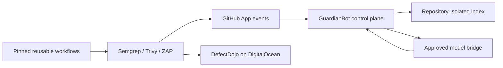

# GuardianBot

GuardianBot is a reusable, provider-neutral GitHub App for advisory AI code review
and deterministic security enforcement. Installing the App gives a repository an
isolated inventory and advisory review; one generated pull request adds centrally
maintained Semgrep and Trivy checks without repository secrets or copied scanner
logic.

## What the PoC demonstrates

- GitHub App webhook authentication, repository discovery, onboarding issues, and
  in-place PR review comments.
- A vendor-neutral `guardian.review.v1` HTTP contract with strict JSON Schema and
  changed-line validation. Models get bounded text, no tools, credentials, or
  GitHub access.
- `guardianctl onboard`, `doctor`, `enforce`, `upgrade`, `inventory`, and
  `offboard`.
- Reusable scanner, image, SBOM/signing, and allowlisted ZAP workflows.
- Self-hosted control plane, PostgreSQL, queue, TLS, metrics, and optional
  DefectDojo on DigitalOcean.



## Five-minute local quickstart

```sh
npm install
npm run check
npm run build
node packages/guardianctl/dist/cli.js --help
```

For a published release:

```sh
export GUARDIANBOT_WORKFLOW_SHA=<40-character-published-commit>
node packages/guardianctl/dist/cli.js onboard OWNER/REPOSITORY --dry-run
```

Production-like setup starts with [getting started](docs/getting-started.md).
See [what is verified](docs/status.md), [how it works](docs/how-it-works.md),
[configuration](docs/repository-configuration.md), and the
[security model](docs/security-model.md).

## Repository layout

- `apps/control-plane`: GitHub App HTTP service and repository-isolated state.
- `packages/protocol`: canonical provider-neutral request/result schemas and client.
- `packages/core`: detection, configuration, indexing, policy, and GitHub primitives.
- `packages/guardianctl`: reusable repository onboarding and administration.
- `.github/workflows`: centrally maintained security, image, and DAST workflows.
- `infra`: DigitalOcean-only deployment definitions.
- `docs`: user, protocol, security, operations, runbooks, ADRs, and roadmap.

GuardianBot is a PoC. The release-controlled matrix in
[docs/status.md](docs/status.md) is authoritative; roadmap text is not a claim of
working behavior.
