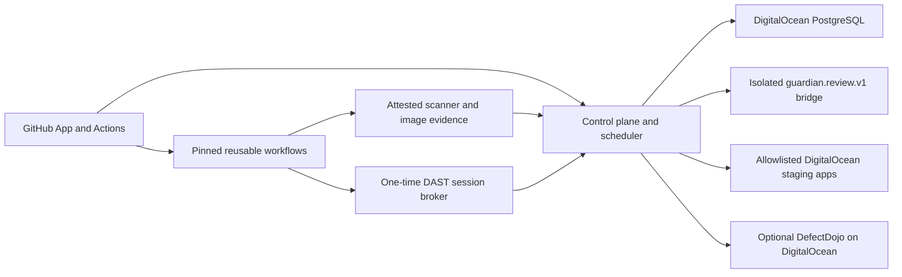

# Architecture

The control plane is a horizontally replaceable Node service. PostgreSQL owns
repository records, webhook leases, review state, trusted scanner evidence,
monitoring snapshots, one-time DAST issuances, and deployment-promotion leases.
Its current background workers run in the same service with durable claims;
Valkey remains reserved for a future independently scaled queue.

Reusable GitHub-hosted workflows execute untrusted repository builds outside
the control plane. The isolated model bridge is the only component that knows a
provider API contract or credential. DigitalOcean hosts the control plane,
PostgreSQL, isolated staging, and optional DefectDojo; no other cloud or
database provider is part of the PoC.

Trust boundaries:

1. GitHub webhooks enter through HMAC and delivery replay validation.
2. Repository content is untrusted and stays labeled by repository ID, commit
   SHA, visibility, and related-repository allowlist.
3. The model bridge is an untrusted compute boundary: bounded inputs, no tools,
   strict output schema, and no control-plane credential.
4. Scanner evidence crosses from GitHub Actions only after exact workflow and
   attestation verification.
5. DigitalOcean deployment authority is bound to an administrative
   repository/app/service/image allowlist and an exact registry digest.
6. DAST credentials cross only through a one-time GitHub OIDC-bound broker to an
   exact public HTTPS staging origin.

One backend failure cannot block deterministic checks. One repository's context is
never queried for another unless both configurations explicitly allow the
relationship. Context from a private or internal related repository never flows
into a public repository review.

Core index version 2 keys every snapshot by stable repository scope and exact
commit. Tree-sitter WASM extracts symbols, imports, and name-resolved call edges
for Python, JavaScript/TypeScript, Swift, and Ruby; unsupported, oversized, or
parser-failing files retain deterministic text indexing. Embeddings are
local-only: a caller may provide a deterministic local model, otherwise
GuardianBot labels and uses lexical feature hashing rather than claiming
semantic vectors.

The current control plane loads only the index for the exact reviewed commit.
Durable pgvector storage, independent worker scaling, high availability, and
production-scale historical retrieval remain roadmap work and are marked
Partial in [capability status](status.md).
