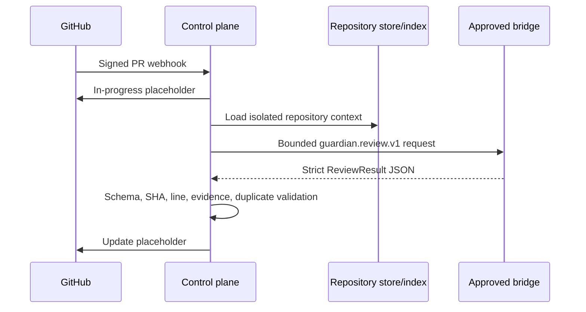
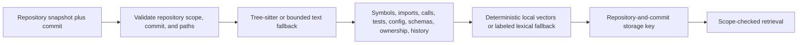
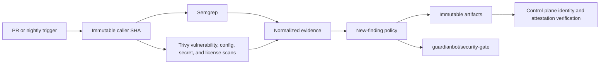
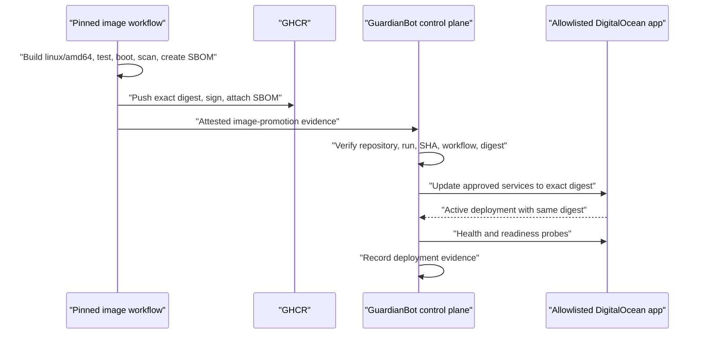
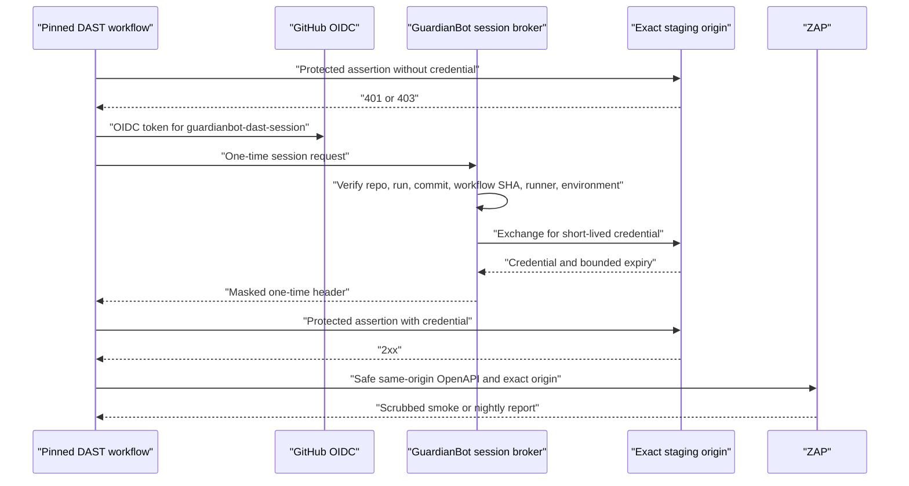

# How it works

## Event to review

The bridge gets no tools, tokens, network authority, or GitHub client.

## Repository index and review scope

Retrieval always supplies the expected repository scope and commit. Related
repositories require a bilateral administrative allowlist, and non-public context
cannot flow into a public review. Repository text and history remain untrusted data;
control tokens are escaped before review-bundle wrapping.

Reviews of at most 50 files and 5,000 changed lines use the full changed-symbol
graph. Above either limit the result is explicitly partial: GuardianBot selects
deterministic security clusters (identity, secrets, supply chain, schemas, network,
and runtime policy), expands their callers, callees, tests, and supporting files,
and reports the omitted paths.

## Workflow to gate

AI findings remain advisory. Scanner crashes and missing evidence fail deterministic
enforcement.

## Image and DAST

The DigitalOcean API token and target allowlist exist only on the control
plane. Monitoring reports an image protected only when its scan, SBOM,
signature, and deployment evidence agree on the registry digest.

The 15-minute smoke and nightly authenticated scans use distinct evidence and
DefectDojo import identities. Expected-run reconciliation, index freshness,
evidence freshness, suppression expiry, exact signed/deployed digest matching,
and weekly aggregate coverage are persisted by the monitoring scheduler.
