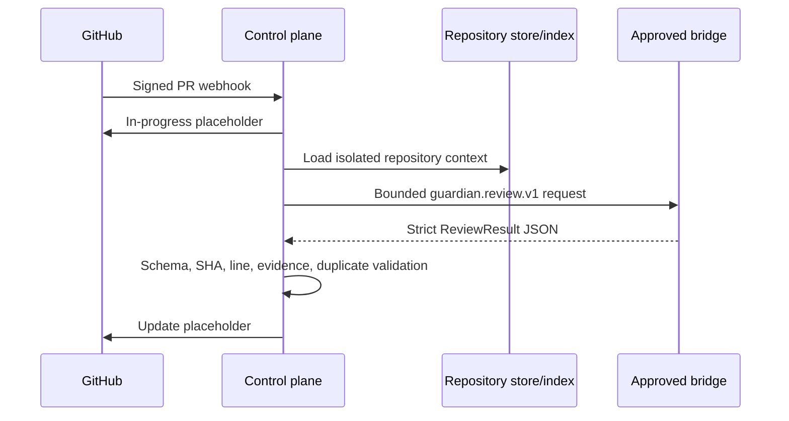
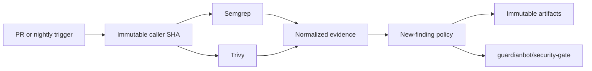

# How it works

## Event to review

The bridge gets no tools, tokens, network authority, or GitHub client.

## Workflow to gate

AI findings remain advisory. Scanner crashes and missing evidence fail deterministic
enforcement.

## Image and DAST

The image workflow builds one `linux/amd64` image, runs smoke checks, scans it,
creates CycloneDX, pushes by content, signs keylessly, and verifies workflow
identity. The same digest is the only valid DigitalOcean staging promotion input.
ZAP accepts only the configured exact HTTPS origin and safe OpenAPI artifact.

Nightly callers provide full scans. The production roadmap adds reconciliation for
deployed digest rescans, expected runs, imports, expiry, and weekly value reporting.
