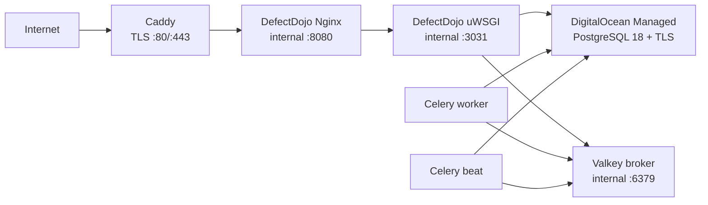

# DefectDojo OSS on DigitalOcean

This directory is the production-oriented GuardianBot definition for DefectDojo
OSS 3.1.200. It deploys only to an `linux/amd64` DigitalOcean Droplet and connects
only to a dedicated DigitalOcean Managed PostgreSQL 18 database. It does not
create or access cloud resources by itself.

The upstream evaluation Compose file explicitly requires production
customization. This definition supplies that customization while preserving the
official service entrypoints and initialization behavior.

## Security properties

- Every container image is pinned to an immutable `linux/amd64` manifest.
- PostgreSQL is not a container. The only accepted database hostname ends in
  `.db.ondigitalocean.com`.
- PostgreSQL uses `sslmode=verify-full` with the DigitalOcean cluster CA mounted
  read-only into Django containers.
- Secrets exist only in `/etc/guardianbot/defectdojo.env`, owned by root with
  mode `0600`. The repository includes no deployable secret.
- Only Caddy publishes host ports: TCP 80/443 and UDP 443. PostgreSQL, Valkey,
  uWSGI, and the upstream Nginx container have no host port.
- Caddy terminates public TLS, removes the server header, caps request bodies,
  and prevents public access to upstream health and metrics paths.
- Application containers run without Linux capabilities, with
  `no-new-privileges`, read-only root filesystems where upstream behavior
  permits, bounded memory/CPU/PIDs, and rotated container logs.
- The DefectDojo initializer is a one-shot migration/bootstrap job. Runtime
  services start only after it exits successfully.
- Bootstrap admin and JIRA webhook secrets are passed only to the initializer,
  not to uWSGI or Celery.
- Backups preserve the immutable release manifest and checksums. Restore refuses
  a backup from a different release definition.
- Every installed Compose, proxy, operator-script, cloud-init, and systemd file
  is SHA-256-bound to `release-manifest.json`; installation resolves and records
  the exact clean GuardianBot source commit, and operational commands reject
  stack or unit drift.

## Pinned release

| Component | Immutable image |
| --- | --- |
| DefectDojo Django | `defectdojo/defectdojo-django:3.1.200@sha256:b2b7b00ef0d53b6a7dd0b12ed2f645bef42263aeef674144bddead2d78cf65ad` |
| DefectDojo Nginx | `defectdojo/defectdojo-nginx:3.1.200@sha256:322fc39b1dfcdb78a3bcbdc9b3b413e4e74b8853ff8ca484922289f58d3e1468` |
| Valkey | `valkey/valkey:9.1.0-alpine@sha256:a35428eba9043cc0b79dbe54100f0c92784f2de00ad09b01182bfb1c5c83d1bd` |
| Caddy | `caddy:2.11.4-alpine@sha256:98eb57d882ccd5213d1688764db10c1ca2c58a1ca3a6717a3411ad798f7a423a` |
| PostgreSQL client (operator profile only) | `postgres:18.4-alpine@sha256:1b1689b20d16a014a3d195653381cf2caa75a41a92d93b255a9d6ea29fd353aa` |

The source release is the official
[`3.1.200` tag](https://github.com/DefectDojo/django-DefectDojo/releases/tag/3.1.200),
commit `f2163b4f7618847ae6f61df336623d37548fdbfc`. The machine-readable record is
[`release-manifest.json`](release-manifest.json).
The exact upstream contracts and deliberate production changes are recorded in
[`UPSTREAM.md`](UPSTREAM.md).

## Topology



The `app` Docker network is internal. Django services also join a separate
egress network so they can reach the managed database and approved integrations.

## Required DigitalOcean resources

Use the same DigitalOcean region and VPC for:

- one x86_64 Droplet with at least 4 vCPU and 8 GiB RAM;
- one dedicated Managed PostgreSQL 18 cluster, database, and least-privilege
  application user;
- one Reserved IP and a DigitalOcean DNS `A` record for the DefectDojo hostname;
- one Cloud Firewall allowing inbound TCP 80/443, UDP 443, and SSH only from an
  operator allowlist;
- PostgreSQL trusted sources restricted to the Droplet/VPC. Do not permit every
  public source.

Do not expose ports 3031, 6379, 8080, 8081, or the PostgreSQL port. See
[`DIGITALOCEAN.md`](DIGITALOCEAN.md) for the exact boundary.

## First deployment

These steps run on the Droplet as root after the DigitalOcean resources, DNS,
Docker Engine, and Docker Compose plugin exist.

1. Save the dedicated database user's password in a temporary root-owned file:

   ```bash
   install -m 0600 /dev/null /root/defectdojo-db-password
   editor /root/defectdojo-db-password
   ```

2. Download the Managed PostgreSQL CA from DigitalOcean and install it:

   ```bash
   install -d -m 0700 /etc/guardianbot
   install -m 0644 -o root -g root ca-certificate.crt /etc/guardianbot/do-postgres-ca.crt
   ```

3. Generate the root-only environment file. Secret values are never printed:

   ```bash
   sudo ./scripts/generate-env.sh \
     --domain defectdojo.example.com \
     --acme-email operator@example.com \
     --admin-email operator@example.com \
     --database-host private-cluster.db.ondigitalocean.com \
     --database-password-file /root/defectdojo-db-password \
     --database-name defectdojo \
     --database-user defectdojo
   rm /root/defectdojo-db-password
   ```

4. Install the immutable stack and units without starting them:

   ```bash
   sudo ./scripts/install-host.sh
   sudo /opt/guardianbot-defectdojo/scripts/preflight.sh
   sudo /opt/guardianbot-defectdojo/scripts/pull-and-verify-images.sh
   ```

5. Confirm that the DNS record resolves to the Reserved IP and Cloud Firewall
   rules are active. Then enable the stack and nightly backup timer:

   ```bash
   sudo systemctl enable --now guardianbot-defectdojo.service
   sudo systemctl enable --now guardianbot-defectdojo-backup.timer
   sudo /opt/guardianbot-defectdojo/scripts/doctor.sh
   ```

The first initializer run applies migrations, loads official fixtures, and
creates the administrator. Retrieve the initial administrator password only
from the root-owned env file, store it in an approved password manager, log in,
and change it.

Create a dedicated DefectDojo automation user and API token at `/api/key-v2`.
Store that token only in the GuardianBot control-plane environment as
`GUARDIANBOT_DEFECTDOJO_API_TOKEN`, referenced by
`GUARDIANBOT_DEFECTDOJO_API_TOKEN_REF`; never put it in a consumer repository.

## Day-two operations

```bash
# Deterministic local definition checks
node validate-config.mjs
node --test ../../tests/infra-defectdojo.test.mjs

# Live stack checks
sudo /opt/guardianbot-defectdojo/scripts/doctor.sh

# Consistent logical database + media + Caddy state backup
sudo /opt/guardianbot-defectdojo/scripts/backup.sh --retention-days 14

# Apply the currently installed immutable release after a required backup
sudo /opt/guardianbot-defectdojo/scripts/apply-release.sh
```

The backup job briefly pauses public and worker write paths so the PostgreSQL
dump and media archive describe the same point in time. Valkey is intentionally
not backed up because it is a replayable task broker, not the source of security
evidence. DigitalOcean managed backups remain required in addition to these
logical backups. Backup and restore run a profile-gated PostgreSQL 18.4 client;
that utility container never starts a database or publishes a port.

Never run `docker compose down --volumes`. The named media, broker, and Caddy
volumes use stable names specifically to survive upgrades and host restarts.

Restore and upgrade procedures, failure handling, credential rotation, and
emergency shutdown are in [`RUNBOOK.md`](RUNBOOK.md).

## Verification boundary

Repository tests prove that the Compose model is syntactically valid, uses the
expected services/digests, has no local PostgreSQL service, limits published
ports, enforces the CA/TLS environment, and keeps bootstrap secrets out of
runtime services.

Live status must remain unverified until all of the following evidence exists:

- `preflight.sh` and `pull-and-verify-images.sh` pass on the target Droplet;
- the initializer exits zero;
- `doctor.sh` proves HTTPS, security headers, Django deploy checks, container
  health, and a TLS-backed PostgreSQL session;
- one backup and same-release restore drill pass;
- the GuardianBot control plane imports and reimports a fixture scan through a
  dedicated API token.

## Upstream references

- [DefectDojo production guidance](https://docs.defectdojo.com/get_started/open_source/running-in-production/)
- [DefectDojo installation guidance](https://docs.defectdojo.com/get_started/open_source/installation/)
- [DefectDojo architecture](https://docs.defectdojo.com/get_started/open_source/architecture/)
- [DefectDojo API v2](https://docs.defectdojo.com/automation/api/api-v2-docs/)
- [DefectDojo upgrade guide](https://docs.defectdojo.com/releases/os_upgrading/upgrading_guide/)
- [DigitalOcean PostgreSQL connection guidance](https://docs.digitalocean.com/products/databases/postgresql/how-to/connect/)
